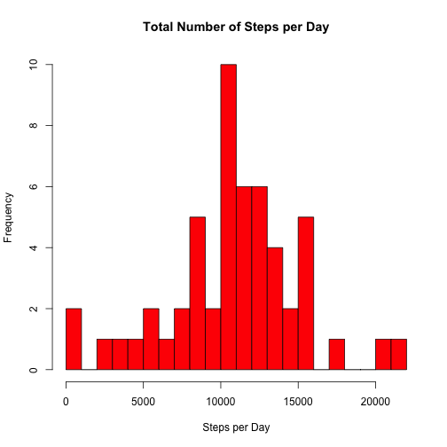
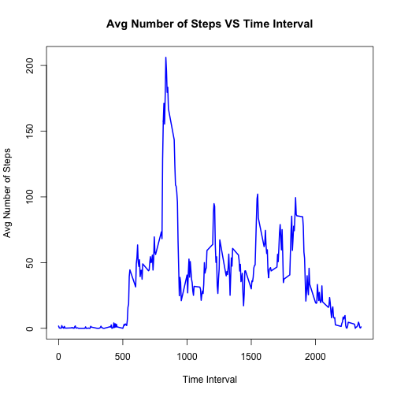
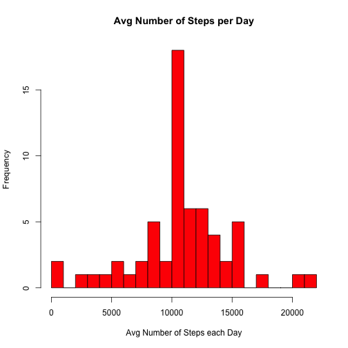
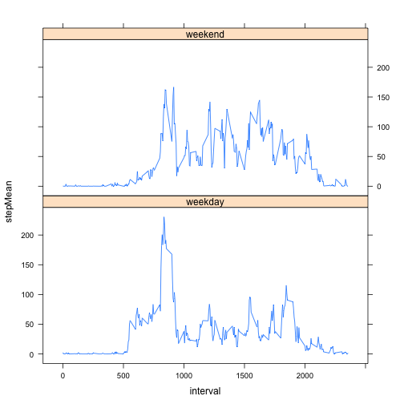

## Loading and preprocessing the data

The following packages are used to produce this report:


```r
library("plyr")
library("lattice")
```

Read the csv dataset:


```r
##Read csv data
setwd("/Users/mchan/desktop/Coursera")
mydata <- read.csv(file="activity.csv",head=TRUE,sep=",")
mydata$date <- as.Date(mydata$date)
```


## What is the mean total number of steps taken per day?

Total number of steps is calculated for each day


```r
##aggregate data to grab steps taken per day
steps_day <- aggregate(steps ~ date, mydata, sum, na.action = na.omit)
```

The below histogram represents the distribution aggregated above.  We ignored days with NA steps


```r
hist(steps_day$steps,breaks = 25, col = "red", 
     main = "Total Number of Steps per Day",
     xlab = "Steps per Day")
```

 

The mean total steps taken in a day is 

```r
mean(steps_day$steps, na.rm=TRUE)
```

```
## [1] 10766.19
```


The median total steps taken in a day is 

```r
median(steps_day$steps, na.rm = FALSE)
```

```
## [1] 10765
```

## What is the average daily activity pattern?

Total number of steps is first calculated for each 5-min interval


```r
##average steps per interval 
steps_interval <- aggregate(steps ~ interval, mydata, mean, na.action = na.omit)
```

Make a time series plot (i.e. type = "l") of the 5-minute interval (x-axis) and the average number of steps taken, averaged across all days (y-axis)


```r
with(steps_interval, plot(interval, steps, type = "l", lwd = 2, 
                                  xlab = "Time Interval", ylab = "Avg Number of Steps", 
                                  main = "Avg Number of Steps VS Time Interval",
                                  col = "blue"))
```

 

Which 5-minute interval, on average across all the days in the dataset, contains the maximum number of steps? 8:35 - 8:40

```r
i <- with(steps_interval, which.max(steps))
max_interval <- steps_interval[i, "interval"]
max_steps <- steps_interval[i, "steps"]
max_interval
```

```
## [1] 835
```

## Inputting missing values

Calculate and report the total number of missing values in the dataset (i.e. the total number of rows with NAs). There are 2304 missing values.


```r
na_index = is.na(mydata$steps)
sum(na_index)
```

```
## [1] 2304
```

Devise a strategy for filling in all of the missing values in the dataset. The strategy does not need to be sophisticated. For example, you could use the mean/median for that day, or the mean for that 5-minute interval, etc. <- I used the mean steps per interval to replace the NA's.

Create a new dataset that is equal to the original dataset but with the missing data filled in.


```r
##fill missing n/a
mydatanew <- mydata
for (i in 1:nrow(mydata)) {
  if(is.na(mydata[i,"steps"])) {
    interval <- mydata[i,"interval"]
    index <- which(interval == steps_interval[,"interval"])
    mydatanew[i,"steps"] <- steps_interval[index , "steps"]
  }
}
```

Make a histogram of the total number of steps taken each day and Calculate and report the mean and median total number of steps taken per day. Do these values differ from the estimates from the first part of the assignment? What is the impact of imputing missing data on the estimates of the total daily number of steps?


```r
steps_day2 <- aggregate(steps ~ date, mydatanew, sum)
hist(steps_day2$steps,breaks = 20, col = "red", 
     main = "Avg Number of Steps per Day",
     xlab = "Avg Number of Steps each Day")
```

 

The mean steps per day is now

```r
mean(steps_day2$steps)
```

```
## [1] 10766.19
```

The median steps per day is now

```r
median(steps_day2$steps)
```

```
## [1] 10766.19
```

The estimates do not change much at all even after replacing the NA's.

## Are there differences in activity patterns between weekdays and weekends?

Create a new factor variable in the dataset with two levels – “weekday” and “weekend” indicating whether a given date is a weekday or weekend day.


```r
wd <- weekdays (as.Date (mydatanew$date))
mydatanew$day_type <- factor (wd,
                          levels <- c ('weekday', 'weekend'))
mydatanew$day_type[] <- 'weekday'
mydatanew$day_type[wd %in% c ('Saturday', 'Sunday')] <- 'weekend'
```

Make a panel plot containing a time series plot (i.e. type = "l") of the 5-minute interval (x-axis) and the average number of steps taken, averaged across all weekday days or weekend days (y-axis). See the README file in the GitHub repository to see an example of what this plot should look like using simulated data.


```r
spi <- ddply (mydatanew,
              .(interval, day_type), 
              summarize, 
              stepMean = mean(steps, na.rm=TRUE))
xyplot (stepMean ~ interval | day_type, 
        data=spi,
        type='l',
        layout=c (1, 2))
```

 


